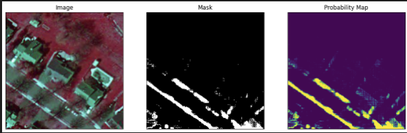

# SAM_Sidewalk
Segment Anything Model Finetuning for Remote Sensing Applications Demo is hosted [here](https://huggingface.co/spaces/yvesnieto/SAM_Sidewalk)

## Milestone 2

As you can see the notebook is working to view the masking fo the satellite images. I am working with CPU so it takes a while on my machine.
But with using google collab it is much quicker

## Milestone 3

Go into the masking.ipynb and run cells one by one.

Using the sidewalk dataset im able to finetune the SAM model. Bellow are examples of the working masking.

## Milestone 4

Implementing into shiny spaces.

it is hosted at this link [here](https://huggingface.co/spaces/yvesnieto/SAM_Sidewalk)

Bellow is the video demo

https://github.com/yvesnietoast/cs370-assignments/assets/114695383/0aef49cb-90be-48ca-b6fd-c90852b90ee7
