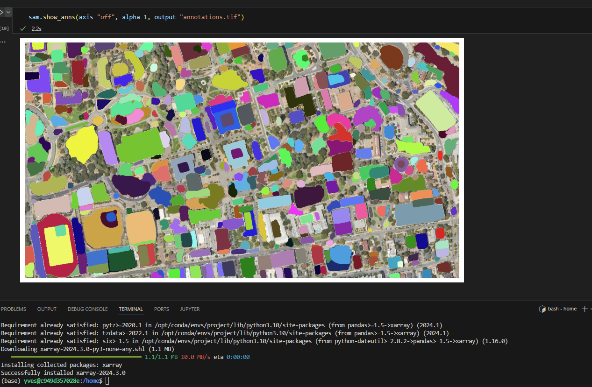
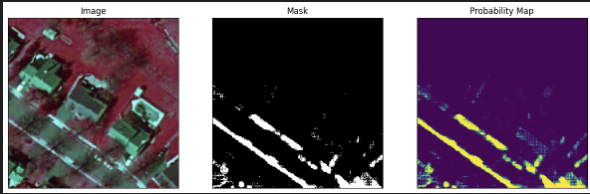

## Milestone 2

As you can see the notebook is working to view the masking fo the satellite images. I am working with CPU so it takes a while on my machine.
But with using google collab it is much quicker

## Milestone 3

Go into the masking.ipynb and run cells one by one.

Using the sidewalk dataset im able to finetune the SAM model. Bellow are examples of the working masking.

## Milestone 4
Reviewing shiny for website 
Started shiny review